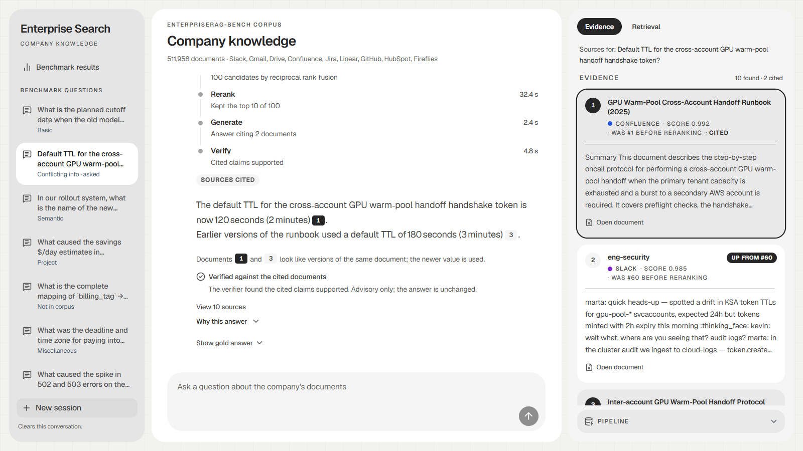
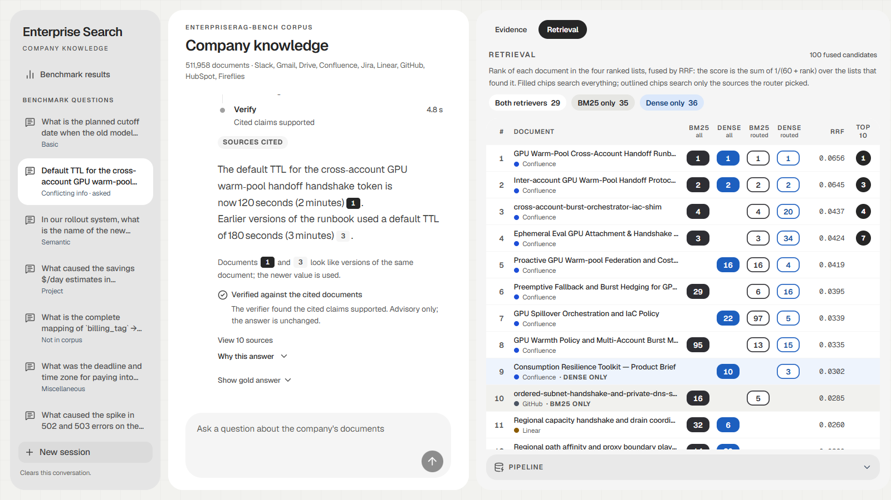
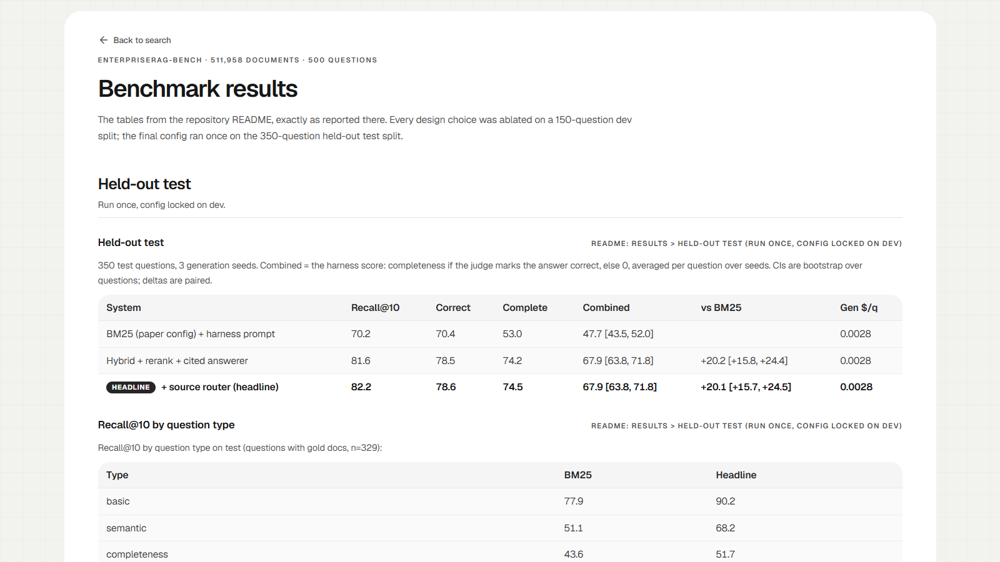

# enterprise-search-rag

Ask a question about a company's internal knowledge (Slack, email, tickets, docs, 512K documents in all) and get an answer where every claim cites the document it came from. When the documents don't hold the answer, it says so instead of guessing.

I built it against a published benchmark, [EnterpriseRAG-Bench](https://huggingface.co/datasets/onyx-dot-app/EnterpriseRAG-Bench), so every design choice is backed by a number, and I ran the final system once on a held-out test split nobody tuned on.

## Contents

- [At a glance](#at-a-glance)
- [What it looks like](#what-it-looks-like)
- [The pipeline in one line](#the-pipeline-in-one-line)
- [Results](#results)
  - [Held-out test (run once, config locked on dev)](#held-out-test-run-once-config-locked-on-dev)
  - [Dev ablations](#dev-ablations)
  - [Serving latency](#serving-latency)
- [Findings](#findings)
- [Limitations](#limitations)
- [How it works](#how-it-works)
- [MCP server](#mcp-server)
  - [Demo API](#demo-api)
- [Reproduce](#reproduce)
- [Repo layout](#repo-layout)

## At a glance

| | |
|---|---|
| Score on the 350-question held-out test | **67.9** vs **47.7** for the paper's BM25 baseline (+20.1, 95% CI +15.7 to +24.5) |
| Recall@10 | **82.2** vs 70.2 |
| Cost | **$0.0028** of generation per question. A frontier file agent does no better on dev at 7.6x the cost |
| Trust checks | Paper's BM25 baseline reproduced exactly; LLM judge validated against 100 blind hand labels (TPR 0.91, TNR 0.94) |
| Serving | MCP server (`search`, `answer`, `get_document`) and a streaming demo UI |

## What it looks like

An answer with its pipeline steps, citation chips, the version-conflict note and the verifier check. The right rail shows the 10 reranked documents, with where each one ranked before reranking.



The Retrieval tab: every candidate's rank in BM25, dense, and both again restricted to the sources the router picked, fused with RRF. It shows what each retriever found that the other missed.



The benchmark page renders the results tables from this README. A test fails if the two ever disagree.



The UI replays real recorded runs, so it works without the GPU or indexes: `cd web && npm ci && npm run dev`. Screenshots come from `npm run e2e:screenshots`.

## The pipeline in one line

**Route** (LLM picks 1 to 3 of 9 sources) → **Retrieve** (BM25 + dense, on all sources and on the routed ones) → **Fuse** (RRF) → **Rerank** (Qwen3 cross-encoder, top 100 to top 10) → **Answer** (cites every claim, prefers the newest version, abstains when unsupported) → **Verify** (a second model family checks each cited claim and sets a confidence flag)

Details in [How it works](#how-it-works).

## Results

### Held-out test (run once, config locked on dev)

350 test questions, 3 generation seeds. Combined = the harness score: completeness if the judge marks the answer correct, else 0,
averaged per question over seeds. CIs are bootstrap over questions; deltas are paired.

| System | Recall@10 | Correct | Complete | Combined | vs BM25 | Gen $/q |
|---|---|---|---|---|---|---|
| BM25 (paper config) + harness prompt | 70.2 | 70.4 | 53.0 | 47.7 [43.5, 52.0] | | 0.0028 |
| Hybrid + rerank + cited answerer | 81.6 | 78.5 | 74.2 | 67.9 [63.8, 71.8] | +20.2 [+15.8, +24.4] | 0.0028 |
| + source router (headline) | 82.2 | 78.6 | 74.5 | 67.9 [63.8, 71.8] | +20.1 [+15.7, +24.5] | 0.0028 |

Recall@10 by question type on test (questions with gold docs, n=329):

| Type | BM25 | Headline |
|---|---|---|
| basic | 77.9 | 90.2 |
| semantic | 51.1 | 68.2 |
| completeness | 43.6 | 51.7 |
| project_related | 67.1 | 70.4 |
| conflicting_info | 78.6 | 89.3 |
| constrained | 85.7 | 95.2 |
| intra_document_reasoning | 89.3 | 96.4 |
| miscellaneous | 85.7 | 100.0 |

Generator and judge are both `openai.gpt-oss-120b` on Bedrock; the paper uses GPT-5.4. Recall is directly comparable to the
paper, judge-based scores are compared only between systems in this repo.

### Dev ablations

150 dev questions (141 with gold docs for recall). Every row was decided before test was touched.

Retrieval, recall@10:

| Stage | Recall@10 | Note |
|---|---|---|
| BM25, own implementation | 63.6 | OpenSearch with the paper config: 64.3 |
| Dense, Qwen3-Embedding-0.6B, 512-token chunks, MaxP | 48.4 | |
| Hybrid, RRF k=60 over BM25 + dense top-100 | 67.6 | k in {10, 20, 60, 100} swept, 60 best |
| + rerank top-100 (Qwen3-Reranker-0.6B) | 74.5 | depth 20: 74.1, depth 50: 75.3 |
| + source router (headline) | 77.6 | +3.1 [+0.8, +6.2] over no router |
| Rerank, model-card instruction instead of custom | 75.4 | +0.9 [-3.3, +5.2], kept custom |
| RRF(rerank, hybrid) instead of pure rerank | 77.7 | end to end +0.1, kept pure rerank |

Dense index variants (hybrid recall@10, everything else fixed):

| Dense index | Hybrid recall@10 | Size |
|---|---|---|
| fp16, exact (headline) | 67.6 | 3.15 GB |
| int8 scalar | 67.6 | 1.58 GB |
| binary, Hamming | 63.2 | 197 MB |
| binary + fp16 rescore of a 4x shortlist | 67.5 | 197 MB in RAM, fp16 on disk |
| whole-document embedding (first 8192 tokens) | 67.1 | 1.05 GB |

End to end, 3 seeds unless noted:

| System | Correct | Combined | vs BM25 | Gen $/q |
|---|---|---|---|---|
| BM25 + harness prompt | 62.7 | 42.2 [35.5, 48.6] | | 0.0029 |
| Rerank + harness prompt | 68.7 | 45.5 [39.0, 51.9] | +3.3 [-1.8, +8.3] | 0.0027 |
| Rerank + cited answerer | 70.2 | 57.9 [51.2, 64.4] | +15.7 [+9.1, +22.3] | 0.0028 |
| Rerank + cited answerer, 5 docs of context | 65.3 | 55.0 [48.0, 61.9] | +12.8 [+6.2, +19.6] | 0.0016 |
| Rerank + cited answerer, 20 docs of context | 70.4 | 59.3 [52.8, 65.9] | +17.2 [+10.6, +23.9] | 0.0052 |
| Router + rerank + cited answerer (headline) | 73.8 | 62.2 [55.8, 68.7] | +20.1 [+13.6, +26.8] | 0.0028 |
| gpt-6-luna file agent, 1 seed | 70.7 | 58.5 [51.3, 65.8] | +16.4 [+9.0, +23.9] | 0.0214 |

### Serving latency

Online pipeline (`entsearch-mcp`, headline config) on a laptop: RTX 3050 6 GB, i5-13450HX, 16 GB RAM. 50 dev questions.

| Stage | p50 | p90 | Where it runs |
|---|---|---|---|
| Route | 0.7 s | 1.3 s | gpt-oss-120b on Bedrock, low effort |
| Retrieve, fuse, fetch | 8.0 s | 10.4 s | BM25 in process; dense exact scan of the 3.15 GB fp16 index on CPU, memory-mapped |
| Rerank 100 docs | 34.2 s | 41.8 s | Qwen3-Reranker-0.6B fp16 on the GPU, up to 4096 tokens per doc |
| Generate | 3.9 s | 12 s | gpt-oss-120b on Bedrock |

The reranker dominates: 100 long documents on a 6 GB laptop GPU. On dev, depth 20 keeps recall@10 within noise (74.1 vs 74.5)
at a fifth of the reranker work, and `--dense binary` keeps the dense index in 197 MB of RAM.

Parity with the batch runs: the online top 10 has the same recall@10 as the batch run (88.0 vs 88.0 on these 50), overlap@10
0.992, and the identical list in order for 64% of questions. Routing and BM25 match batch exactly. The rest is floating
point: the batch dense search scored in fp16 on the GPU with vLLM query vectors, the online one scores in fp32 on the CPU
with a transformers query encoder (cosine 0.9999 to the vLLM vectors), and near-tied chunks reorder.

## Findings

**The pipeline's gain over BM25 holds on test.** +15.7 on dev at the same stage, +20.2 on test. Most of it comes from two
places: hybrid retrieval plus reranking lift recall@10 by about 11 points, and the cited answerer lifts completeness (64.7
vs 53.5 on dev with the same docs) far more than correctness (70.2 vs 68.7).

**When the system is wrong, it rarely says so, and a verifier flag helps only partly.** On test, 20% of non-refusal
answers are judged wrong, and the answerer abstains on under 1% of answerable questions. A confidence flag now marks
answers to double-check: gpt-6-luna (a different model family from the gpt-oss judge) checks each cited claim against its
document, and an answer is also flagged when the reranker's top score is below 0.949. The flag never changes the answer,
so the scores above are unaffected. The threshold was picked on dev by max F1; the test row is one pass with everything
locked, on seed-0 answers.

| Split | Answers | Wrong | Flagged | Wrong answers caught | Correct answers flagged | Correct if not flagged | Correct if flagged |
|---|---|---|---|---|---|---|---|
| Dev | 145 | 27.6% | 58 | 77.5% [65.0, 90.0] | 25.7% [17.1, 34.3] | 89.7% [82.8, 95.4] | 46.6% |
| Test | 335 | 20.0% | 140 | 71.6% [59.7, 82.1] | 34.3% [28.7, 40.3] | 90.3% [86.2, 94.4] | 65.7% [57.9, 73.6] |

An unflagged answer is right about 90% of the time; a flagged one is a coin flip on dev and two in three on test. The flag
is noisy: on test two of every three flags land on correct answers, mostly "partially supported" verdicts on long
multi-claim answers, and the false-alarm rate rose from 26% on dev to 34%. Almost all of the signal comes from the
verifier: the reranker score alone barely separates right from wrong (AUROC 0.56). Cost about $0.0023 per answer and a few
seconds; `--no-verify` turns it off.

**The source router did not replicate.** On dev it added +4.4 [+1.1, +7.7] end to end and +3.1 recall@10, mostly on semantic
questions (+8.1). On test it is -0.1 [-2.3, +2.1] end to end and +0.6 recall@10. It stays in the headline because that was the
call made on dev before test was run; I report the test result as is and changed nothing after seeing it. The router is
cheap ($0.00007 per question) and its routing accuracy is weak (top-1 source correct 47.5% on dev), which is why it only adds
routed lists to the fusion instead of filtering.

**A frontier agent does not beat the pipeline.** The benchmark ships a bash file agent; driven by gpt-6-luna it scores 58.5
on dev against 57.9 for the pipeline without router, paired +0.6 [-6.2, +7.9]. The pipeline is 7.6x cheaper per question and
reads 79x fewer input tokens (15.7K vs 1.25M mean). The agent's median time per question is 101 s.

**Prompting the answerer mattered more than any retrieval change after reranking.** Rerank with the harness prompt is +3.3
over BM25 and not significant; the same retrieval with the cited answerer is +15.7.

**Several plausible upgrades bought nothing.** Rerank depth 20 vs 50 vs 100, the model-card reranker instruction, 5 or 20
docs of context instead of 10, RRF of rerank and hybrid, and whole-document embeddings were all within noise. Context 20
costs 1.9x more generation for +1.4.

**Binary quantization with rescoring is free.** Sign bits plus an fp16 rescore of a 4x shortlist match exact search (67.5 vs
67.6) with a 197 MB in-memory index instead of 3.15 GB. The MCP server exposes it as `--dense binary`.

**Reproduction.** OpenSearch 2.19.1 with the harness's exact index settings and query gives recall@10 of 68.4, matching the
paper overall and in each of the 8 question types that have gold documents. The hand-written BM25 (Lucene-identical
tokenizer, same scoring formula) gets 68.3, the gap being Lucene's lossy length norms.

**Judge validation.** I hand-labeled 100 dev answers blind (the labeling tool never shows the judge's verdict).

| TPR | TNR | Agreement | Judge says correct | Hand label says correct |
|---|---|---|---|---|
| 0.912 (95% Wilson 0.82-0.96) | 0.938 (0.80-0.98) | 0.92 | 64% | 68% |

**Near-duplicate detection.** MinHash found 1 of 722 gold docs with a near-duplicate: the corpus is LLM-generated, so
document versions are reworded and lexical overlap is low (Jaccard 0.01 to 0.16). Corpus-wide embedding clustering chained
same-topic docs into one 146,656-doc cluster. Versions are instead flagged pairwise among the retrieved top 10 at query time
(cosine 0.88, picked on dev), and the answerer applies a latest-wins rule to flagged pairs.
Details: [results/neardup_minhash.md](results/neardup_minhash.md), [results/neardup_embed.md](results/neardup_embed.md).

Every decision, its alternatives and the dev numbers behind it are logged in [docs/decisions.md](docs/decisions.md).

## Limitations

- Generator and judge are the same model (gpt-oss-120b). The judge is validated against hand labels, but scores are not
  comparable to the paper's GPT-5.4 leaderboard numbers.
- The frontier agent ran one seed on dev only, with a different generator from the pipeline.
- Abstention is fragile. The answerer refused 3 of 3 seeds on one info-not-found question in the batch runs, but answered
  it when the online reranker swapped two near-tied documents (score drift up to 0.012 from a smaller rerank batch);
  the verifier flagged that answer. Refusals depend on context order as well as content.
- The confidence flag is evaluated against the gpt-oss judge's labels, which are themselves about 92% accurate, so some
  "false alarms" and "misses" are judge errors. It catches about 70% of wrong answers; the rest still look confident.
- Both dense indexes were built from text prompts that vLLM did not end with EOS, while the Qwen3-Embedding model card
  appends EOS before last-token pooling. Online queries match the index, so the system is consistent, but dense alone may be
  weaker than the model allows. Not ablated.
- Questions and corpus are synthetic. The near-duplicate and routing behaviour may differ on real company data.

## How it works

1. **Split.** Stratified 150 dev / 350 test by question type, seed 20261003 ([data/splits/](data/splits/)). All tuning and
   ablations use dev; test was run once.
2. **Route.** `gpt-oss-120b` at low reasoning effort names 1 to 3 of the 9 sources likely to hold the answer.
3. **Retrieve.** Four ranked lists of 100 docs each: hand-written BM25 over a sparse TF index with a tokenizer that matches
   Lucene's `standard` analyzer, dense search with Qwen3-Embedding-0.6B over 1.54M 512-token chunks (each doc scored by its
   best chunk among the top 4000), and both again restricted to the routed sources. RRF with k=60 fuses them into a top 100.
4. **Rerank.** Qwen3-Reranker-0.6B scores each of the 100 docs (full text up to 4096 tokens, fp16) and the top 10 go on.
5. **Answer.** The 10 docs are numbered in context; the answerer cites `[n]` per claim, sees flags on docs that look like
   versions of each other and prefers the latest, and abstains with a fixed sentence when the docs do not answer.
   A gpt-6-luna verifier then checks each cited claim against its document and sets a confidence flag (flag only).
6. **Evaluate.** The harness judge scores correctness, completeness and recall. Paired bootstrap CIs over questions, 3
   generation seeds per system.
7. **Trace.** Batch runs write OpenTelemetry spans to local JSONL, exported to Langfuse when keys are set: BM25 retrieval
   and answer generation, with latency, tokens, dollars and gold-doc hits. The MCP server reports per-stage seconds in each
   response but does not emit spans.

## MCP server

`entsearch-mcp` serves the indexes to any MCP client (Claude Code, Claude Desktop, an agent) with three tools:

| Tool | What it returns |
|---|---|
| `search(query, k=10)` | Top-k docs (id, source, title, snippet, scores), the routed sources, the serving config, per-stage seconds |
| `answer(question)` | Cited answer from the top 10 docs, `[n]` markers mapped to doc ids, abstention and partial flags, confidence flag with the verifier's per-claim verdicts and reasoning, cost |
| `get_document(doc_id)` | Full text of one document |

It needs the indexes under `data/index/` (see Reproduce), the doc store, AWS credentials for the router and answerer, and an
OpenAI Responses-compatible endpoint serving gpt-6-luna for the confidence flag (`llm.BRIDGE_URL`; skip with `--no-verify`):

```bash
uv sync --extra mcp
uv run python -m entsearch.docstore        # data/index/docstore.sqlite, one-time, ~3 GB
uv run entsearch-mcp                       # stdio, headline config: router + hybrid + GPU rerank
uv run entsearch-mcp --no-rerank --dense binary --device cpu        # CPU only, 197 MB dense index in RAM
uv run entsearch-mcp --transport streamable-http --port 8000
```

Claude Code: `claude mcp add entsearch -- uv run --directory /path/to/repo entsearch-mcp`. Indexes load in a background
thread (about a minute), so the client connects at once and the first call waits for them.
`scripts/check_pipeline.py` checks that the online pipeline returns the same top 10 as the batch runs and times each stage.

### Demo API

`entsearch-demo` serves the same pipeline over HTTP for the demo UI, streaming each stage (route, retrieve, fuse, rerank,
answer, verify) as a server-sent event so the UI can show the pipeline working. Contract: [docs/demo-api.md](docs/demo-api.md).
`web/fixtures/` holds real recorded runs of the demo questions (`scripts/record_demo_fixtures.py`), so the UI can be built
and replayed without the indexes or a GPU. The UI is a Next.js app in [web/](web/README.md): it replays the fixtures by
default, or talks to the live backend when `NEXT_PUBLIC_API_BASE` is set.

```bash
uv sync --extra demo
uv run entsearch-demo                      # http://127.0.0.1:8000/api
uv run entsearch-demo --fresh-cache        # empty LLM cache: router, answer and verifier calls are all real
cd web && npm ci && NEXT_PUBLIC_API_BASE=http://localhost:8000/api npm run build && npm start
```

## Reproduce

Python 3.11, [uv](https://docs.astral.sh/uv/), an NVIDIA GPU for reranking, and AWS credentials with Bedrock access for
routing, answering and judging. Docker only for the OpenSearch reproduction.

```bash
uv sync
bash scripts/fetch_harness.sh          # pinned harness into third_party/erb (code only)
```

Download the Hugging Face dataset `onyx-dot-app/EnterpriseRAG-Bench` into `data/erb/`, so that
`data/erb/data/documents/test.parquet` and `data/erb/data/questions/test.parquet` exist. Then, for the headline system:

```bash
uv run python scripts/build_sparse_index.py                 # sparse TF index for BM25
uv run python scripts/embed_dense.py                        # chunk + embed with vLLM (about 6 h on one L4)
uv run python scripts/build_neardup_embed.py --vectors      # pooled doc vectors for version flagging
uv run python scripts/dump_candidates.py bm25               # top-100 per retriever
uv run python scripts/dump_candidates.py dense
uv run python scripts/run_router.py predict                 # route all 500 questions
uv run python scripts/run_router.py retrieve                # RRF over the 4 lists -> runs/hybrid_router
uv run python scripts/run_rerank.py --run rerank_router --candidates hybrid_router
uv run python scripts/rerank_runs.py --scores-run rerank_router
uv run python scripts/run_answers.py rerank_router_d100 --split dev --answerer cited --seed 0
uv run python scripts/kill_test.py bm25_opensearch rerank_router_d100 --seeds 3
```

Ablations: `run_hybrid.py` (RRF k sweep, `--dense` for the whole-doc index), `run_quantized.py`, `embed_dense.py --whole-doc`,
`run_rerank.py --instruction default`, `run_agent_baseline.py` (frontier agent, see its docstring), `run_verifier.py` then
`eval_flagger.py` (confidence flag: dev picks the threshold, test reads it). `eval_retrieval.py`
reports recall, MRR and nDCG per question type; `report_harness.py` the judge metrics. The OpenSearch reproduction is
`docker compose up -d` then `run_opensearch_bm25.py`.

Optional: set `LANGFUSE_PUBLIC_KEY`, `LANGFUSE_SECRET_KEY`, `LANGFUSE_HOST` in `.env` to export traces.

## Repo layout

```
src/entsearch/
  data.py, split.py        corpus/question loading, stratified dev/test split
  analysis.py              Lucene-standard tokenizer
  index/sparse.py          streaming docs x terms TF matrix
  index/chunking.py        paper chunking (copied from the harness)
  index/neardup*.py        MinHash near-dups, embedding near-dups and query-time version flagging
  retrieval/bm25.py        hand-written BM25
  retrieval/opensearch.py  paper BM25 (harness settings and query)
  retrieval/dense.py       single-query dense search (exact or binary + rescore) and query encoder
  retrieval/rrf.py         reciprocal rank fusion
  retrieval/rerank.py      Qwen3-Reranker scoring
  retrieval/router.py      LLM source router
  answerer.py              cited answerer with version flags and abstention
  answer.py                harness-equivalent answer generation
  llm.py                   Bedrock client with disk cache
  metrics.py, stats.py     recall@k, MRR, nDCG; bootstrap and paired bootstrap CIs
  harness.py               wrapper for calling the benchmark harness
  tracing.py               OpenTelemetry spans, JSONL + Langfuse
  docstore.py              SQLite doc store for serving
  serve/pipeline.py        online router -> hybrid -> rerank -> cited answer
  serve/server.py          MCP server (entsearch-mcp)
  serve/demo.py            demo API with per-stage server-sent events (entsearch-demo)
  verifier.py              answer verifier behind the confidence flag
scripts/                   index builds, batch runs, ablations, reports (see Reproduce)
tests/                     unit tests
web/                       Next.js demo UI (web/README.md)
web/fixtures/              recorded demo API runs for the frontend's offline mode
results/                   result tables for the baselines and near-dup studies
docs/decisions.md          every design decision with its reason and numbers
```
